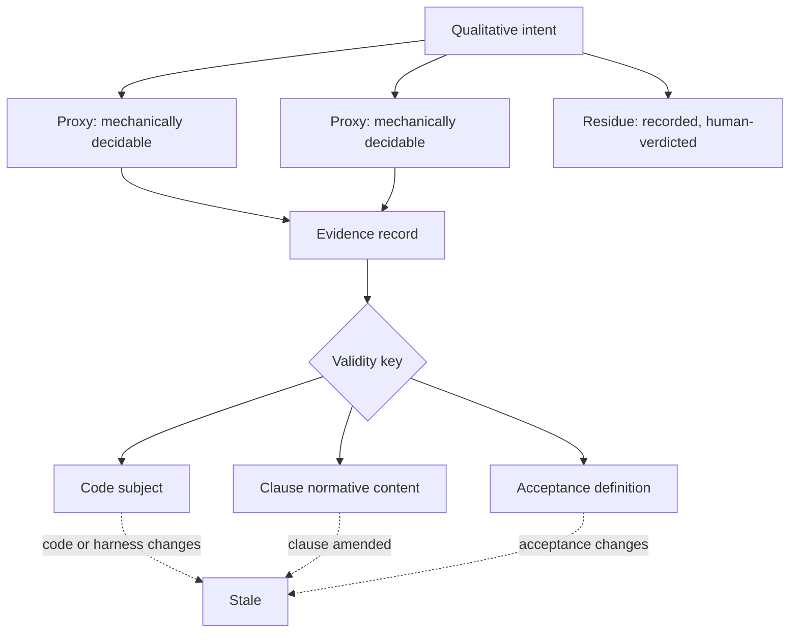
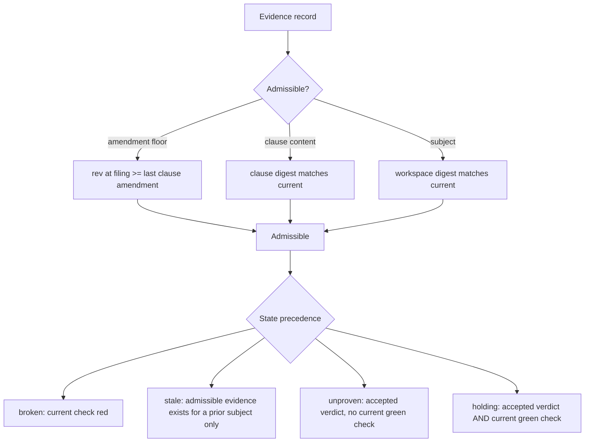

# Contract Kernel v1 - Plan

## Goal Capsule

- **Objective:** Answer one question with evidence — does a contract outlive the changes that satisfy it? Everything here exists to produce that answer or to kill the project honestly.
- **Product authority:** Pyro signs law and verdicts residue. Docket is agent-owned per `memory/decisions/DC-0005-docket-resumes-as-a-contract-kernel-on-one-falsifiable-question.md`; Claude holds decision rights on reviewer findings. The Slipway projection and the live retrofit are named but are not active scope.
- **Authority hierarchy:** The Product Contract wins on product behavior. A Key Technical Decision wins on implementation mechanism within its cited requirements. Units override neither. Pyro signs law and verdicts residue; Claude implements and files evidence and cannot verdict its own residue.
- **Execution profile:** Nine units, dependency-ordered. Units 1 through 4 are substrate repair and can land in any order among themselves; 5 through 7 are the mechanism and are strictly sequential; 8 and 9 are the run.
- **Stop conditions:** Stop and report rather than working around it if any DC-0005 kill condition fires, if a proxy for the overengineering obligation cannot be made mechanically decidable, or if updating a pinned test would require weakening what it asserts rather than correcting what it asserts.
- **Tail ownership:** No PR. Work lands on a branch off `main`; the go/no-go in U9 is the deliverable, not a merge.
- **Open blockers:** None.
- **Product Contract preservation:** unchanged. Planning discovered that the staleness mechanism is partly built (see KTD4) but that finding narrows the implementation, not the requirement — R6's intent is unmet and stands as written.

---

## Product Contract

### Summary

A contract-and-evidence kernel narrow enough to test one claim: that an obligation survives the changes that satisfy it. Evidence binds to the exact code state it was produced against, so amending one clause stales only that clause's evidence while everything else carries forward. The first real obligation in the ledger is "don't overengineer," compiled as intent plus mechanically decidable proxies plus recorded residue, governing docket's own build.

### Problem Frame

Obligations that must hold across many changes have no home. A change-scoped tool creates requirements while planning a change and archives them when the change completes; the obligation dies with the work that satisfied it. What survives instead is repetition — the rule gets restated into each new agent's context, and restatement is not enforcement.

The live example is in this ecosystem already. "Don't overengineer" sits in the user's global instruction file as the key directive, in prose, and still has to be said out loud to agents. It is a conventionally suggested discriminator rather than a structurally enforced one, so it degrades to repetition. That degradation is survivable at one-human scale and not at agent scale: when agents outnumber the humans available to review them, an obligation that survives only by being restated does not survive.

Docket was stopped in June on the conclusion that a mature lifecycle governor already served this need. That conclusion came from comparing features — a governed change's requirement and a persistent obligation's clause can carry the same sentence — rather than comparing lifetimes. The falsifier applied at the time asked whether the contract layer had a consumer no larger tool could serve, which a boundary artifact cannot satisfy by construction. It produced no result, and the no-result was filed as a negative.

### Key Decisions

- KD1. **Resume as a contract-and-evidence kernel, not a lifecycle framework.** (session-settled: user-approved — chosen over closing the project and distilling the methodology: the June stop rested on a falsifier that could not fail.) Governs R5, R6, R7, R8.
- KD2. **Scope to one question rather than a kernel roadmap.** (session-settled: user-approved — chosen over an eight-PR sequence that reaches the decisive test only at the end.) Governs R12, R15.
- KD3. **Code obligations before harness obligations.** Testing where the oracle is a passing test isolates the mechanism from oracle noise; a failure under a judge-shaped oracle is ambiguous between ledger and judge. (session-settled: user-approved — chosen over reviving the agent-harness target: its premise came from the same broken seam hunt.) Governs R12, R14.
- KD4. **Bench test first, self-governed build second, live retrofit held.** (session-settled: user-approved — chosen over starting with the live retrofit: a synthetic failure has exactly one possible cause.) Governs R12, R13, R14.
- KD5. **A qualitative obligation decomposes rather than being refused at the door.** The admission rule demanding a number was right to reject the prose and wrong to leave it homeless. (session-settled: user-approved.) Governs R9, R10, R11.
- KD6. **Docket is agent-owned; Claude resolves reviewer findings.** (session-settled: user-directed.)
- KD7. **Substrate honesty removes the signature claim rather than building an approval command.** Evidence keys on clause content, so editing a clause stales its evidence with or without a signature; the experiment needs no approval step. (session-settled: user-directed — chosen over building a minimal approval bound to the contract digest: that expands v1 past the scoped question.) Governs R1.

The diagram shows why one clause's amendment does not invalidate its neighbours: validity keys on the clause's own content, not on the contract's global revision.

### Actors

- A1. **Authority** — sets the obligation, signs law, verdicts residue. Never files evidence.
- A2. **Implementer** — does the work and files evidence. Cannot verdict its own residue.
- A3. **Ledger** — admits, derives state, refuses. Judges admissibility, never quality.
- A4. **Independent verifier** — adjudicates factual claims with no sight of why anything was chosen.

### Requirements

**Substrate honesty**

- R1. The repository states nothing about its own guarantees that is not true.
- R2. Anchor vocabulary has exactly one source, shared by the runtime and both producer skills.
- R3. A command-kind acceptance whose process exits zero while violating its stated expectation is reported failing.
- R4. Import is atomic — any refusal means nothing becomes law.

**Evidence binding**

- R5. A filed evidence record names the exact code state it was produced against.
- R6. Evidence validity keys on the clause's own normative content, not on the contract's global revision.
- R7. Changing production code or an acceptance harness stales the evidence that depended on it, and writing an evidence record does not stale itself.
- R8. A mechanically checkable clause is never reported holding without current passing mechanical evidence, regardless of any accepted verdict.

**Obligation shape**

- R9. A qualitative intent enters the ledger as intent plus at least one mechanically decidable proxy.
- R10. What the proxies do not cover is recorded on the clause rather than omitted.
- R11. A human-verdict clause names the residue it covers and the authority who verdicts it.

**The experiment**

- R12. One contract governs two successive changes, and the second change's outcome is recorded.
- R13. Each fault injection produces a distinct named state and a message that says what to do about it.
- R14. Docket's own build is governed by a contract carrying the overengineering obligation.
- R15. The run ends in a written go/no-go against the kill conditions in DC-0005.

### Key Flows

- F1. Bench run over the existing fixture
  - **Trigger:** Substrate honesty requirements are satisfied.
  - **Actors:** A1, A2, A3
  - **Steps:** Import the existing contract; implement change A; file evidence; observe clauses holding; implement change B touching a subset; observe untouched clauses carrying forward and touched clauses stale.
  - **Outcome:** The mechanism either discriminates or does not, with one possible cause.
  - **Covered by:** R5, R6, R7, R8, R12

- F2. Self-governed build
  - **Trigger:** F1 discriminates.
  - **Actors:** A1, A2, A3
  - **Steps:** Compile the overengineering obligation as intent plus proxies plus residue; admit it; each change in the kernel's own build files evidence against it; the authority verdicts the residue.
  - **Outcome:** Multi-change survival evidence produced as a byproduct of building, on the obligation the authority actually wants enforced.
  - **Covered by:** R9, R10, R11, R14

- F3. Fault injection
  - **Trigger:** Runs against both F1 and F2.
  - **Actors:** A2, A3
  - **Steps:** Introduce each seeded fault; read the resulting state; compare against the expected state.
  - **Outcome:** The ledger's discrimination is measured rather than assumed.
  - **Covered by:** R13

### Acceptance Examples

- AE1. **Covers R7.** Given a clause holding on filed evidence, when a production file it depends on changes, then the clause reports stale rather than holding.
- AE2. **Covers R7.** Given a clause holding on filed evidence, when an evidence record is written, then the clause does not stale itself.
- AE3. **Covers R6.** Given a contract where one clause is amended, when state is derived, then only the amended clause's evidence is invalidated and unchanged clauses stay admissible.
- AE4. **Covers R5.** Given evidence produced against one commit, when it is offered for a different commit, then it is visible in the ledger and inadmissible for the current subject.
- AE5. **Covers R8.** Given a mechanically checkable clause with a failing check, when a human accepts the evidence bundle, then the clause does not report holding.
- AE6. **Covers R8.** Given an evidence bundle containing no evidence, when it is accepted, then no clause reports holding on it.
- AE7. **Covers R3.** Given a command acceptance whose process exits zero but produces output violating its stated expectation, when the check runs, then the result is failing.
- AE8. **Covers R4.** Given a contract where one clause is refused at the door and others are admitted, when it is imported, then nothing is written.
- AE9. **Covers R2.** Given a contract emitted by either producer skill without hand-editing, when it is imported, then no clause is refused for an unrecognised anchor type.
- AE10. **Covers R13.** Given a deleted acceptance harness, when the gate runs, then the clause reports a distinct state naming the missing harness rather than passing.
- AE11. **Covers R12, R14.** Given an obligation admitted before change A, when change B is planned without mentioning it, then the obligation is still visible as active law.

### Success Criteria

The run continues past v1 only if a contract meaningfully governs both changes, subject binding catches stale or misapplied evidence, selective clause amendment works, and the authority's involvement concentrates on residue rather than on every passing check.

The run stops or narrows if any kill condition in DC-0005 fires. Those conditions are authoritative there and are not restated here; R15 requires the go/no-go to be written against them by name.

### Scope Boundaries

**Deferred for later**

- The deterministic projection into a lifecycle tool, and the lock that prevents the projection becoming an editable authority.
- The live retrofit onto an actively developed repository — the strongest evidence and the worst first move while the mechanism is unproven.
- Gate profiles, generated schema, cryptographic signing infrastructure, evidence-policy enforcement beyond what R10 requires.
- Harness and skill obligations as the governed artifact class.

**Outside this product's identity**

- The courtroom as originally scoped. Cut in June, stays cut.
- Repository exploration, implementation planning, task databases, worktrees, agent spawning, review orchestration, repair loops, deployment, and any second definition of done.

<!-- ce-section: work-relationships -->
### How This Work Fits Together

This plan owns the kernel experiment. The breakdown below is the current understanding, not a committed roadmap; a later plan may revise, split, merge, or discard any of it.

- Kernel experiment (this plan)
  - Enables the lifecycle-tool projection — the projection is only worth building if obligations survive changes.
  - Enables the live retrofit, which depends on a mechanism that discriminates.
- Lifecycle-tool projection
  - Depends on the kernel experiment.
  - Shares the clause identity and digest work with this plan.
- Live retrofit onto an actively developed repository
  - Depends on both of the above.
  - Still to decide — whether the obligation source is that repository's own history or an external authority unrelated to its current work.
- Harness and skill obligations
  - Can proceed independently of the projection.
  - Still to decide — whether the evaluator problem is tractable at all, which is unresolved in Dependencies below.

### Dependencies / Assumptions

- **Load-bearing and unresolved:** no non-human signal is currently known for irreducibly qualitative obligations. The authority was asked directly and answered "I don't know." The proxy-plus-residue shape holds this question rather than answering it; if no such signal exists, the harness direction has a hole in it that this plan does not close.
- Proxies are gameable. Keeping them honest requires the authority to review a sample, which is a weaker promise than the scale argument asks for — the authority stops reviewing everything, not everything.
- Passing tests pin the behaviour R4 and R8 change, so a green suite here is a baseline rather than correctness. `tests/test_import.py::test_refusals_cite_door_checks` asserts a success exit code when at least one clause is admitted, citing design decision 11 — R4 therefore reverses a recorded decision rather than repairing an oversight, and that decision record needs updating alongside the code. `tests/test_tasks_file.py::test_tasks_clear_when_all_green` asserts a clear result from an accepted bundle whose evidence list is empty and for which no check exists; the test name asserts greenness its own fixture never establishes.
- The existing fixture imports cleanly through the door, and the door has not changed since it did.

### Outstanding Questions

**Deferred to Planning**

- Which specific proxies compile the overengineering obligation, and how they are chosen so they are not trivially gamed.
- Subject granularity — whether a commit identity suffices or a workspace identity is needed for uncommitted work.
- Whether the fault-injection set is exactly the one in DC-0005 or extended.

### Sources / Research

- `memory/decisions/DC-0005-docket-resumes-as-a-contract-kernel-on-one-falsifiable-question.md` — the resume decision, six confirmed trust defects, and the kill conditions this plan is measured against.
- `memory/decisions/DC-0003-slipway-wins-lifecycle-docket-narrows-to-contract-layer.md` and `memory/decisions/DC-0004-docket-is-policy-layer-of-agent-harness-cicd-caliper-is-sensor.md` — the superseded reasoning trail, kept because the seam-hunt finding in DC-0003 is still true even though its inference is not.
- `docs/concepts/01-contract-schema-and-door-policy.md` — the admission rules this plan works with rather than around.
- `memory/threads/TH-0001-v0-build-path.md` — closed, but its hollow-oracle watch item names R3's defect in advance.

---

## Planning Contract

### Key Technical Decisions

- KTD1. **Extend the runtime anchor vocabulary to the union of both producers, and pin it with a drift test.** `test`, `policy`, `legacy`, and `regulation-section` name real authority classes that contract-first legitimately compiles from; narrowing the skill would cost expressiveness the door has no reason to refuse. The drift test parses the anchor list out of both producer references and asserts equality with the runtime tuple, so the vocabulary cannot silently fork again. Governs R2.
- KTD2. **A command clause whose expectation is prose-only reports `pending-harness`, not refused and not green.** Refusing at the door would break the graduation fixtures, whose provenance value comes from being unedited dojo output; passing them would keep the false green R3 exists to remove. `pending-harness` already means "law that cannot go green yet", which is exactly true here, and it lets each fixture clause migrate on its own schedule. Governs R3.
- KTD3. **The evidence subject is a workspace digest, not a commit identity.** The run edits files and checks them without committing between steps; a commit-only subject would force a commit per step and change what is being measured. The digest covers HEAD, staged diff, unstaged diff, and untracked content, excluding docket's own generated history so that filing evidence does not stale the evidence being filed. Governs R5, R7.
- KTD4. **Clause-content digests supplement the existing per-clause amendment floor rather than replacing it.** Validity already filters amendments by clause id, so one clause's amendment already leaves its neighbours' evidence admissible. The unmet half is that editing the contract file without recording an amendment leaves evidence valid. Adding a content digest to the validity predicate closes that without disturbing the amendment path. Governs R6.
- KTD5. **Obligation decomposition uses contract-level intents that clauses implement, rather than multi-acceptance clauses.** One clause carrying several acceptances would break the atomicity rule the door enforces. An intent is a named, un-checkable statement; each proxy is an ordinary atomic clause implementing it; the residue is a `verdict: human` clause implementing the same intent and naming what the proxies miss. Governs R9, R10, R11.
- KTD6. **The self-governed build blocks rather than observes.** A proxy failure stops the commit that violated it. Observation would produce a record nobody is obliged to act on, which is the conventionally-suggested discriminator this project exists to replace. (session-settled: user-approved — chosen over recording proxy results without gating: gated failure is the honest test and blocking bites the implementer mid-build, which is the point.) Governs R14.
- KTD7. **Atomic import reverses design decision 11, and the decision record is amended in the same unit.** `docs/plans/2026-06-12-docket-v0-plan-1-ledger-door-state.md:29` records exit 0 on partial admission as intended behavior. Changing the code without amending that record would leave two live decisions in conflict — the second-spec-reality failure this project is named against. Governs R4.

### High-Level Technical Design

The mechanism change is a predicate and a precedence insertion. Evidence currently passes a single revision floor; it will pass a three-part validity predicate. The state chain gains one state between `overlap` and `holding`.

All three parts must hold for admissibility; failing the subject part yields `stale` rather than absence, so the ledger distinguishes "never proven" from "proven against something else".

### Assumptions

- Git is available and the repo is not in a detached or bare state. The subject digest has no meaning otherwise, and the run happens in a normal working clone.
- The graduation fixtures' command clauses are allowed to sit at `pending-harness` for the duration of this work. They are import fixtures, not fulfillment cases.
- One of the eleven acceptance examples — the deleted-harness case — may pass unchanged, because the pending-harness path already exists. It is a regression check, not new work, and a green result there is not evidence the new mechanism works.

### Sequencing

Units 1 through 4 repair the substrate and are independent of one another. Unit 5 introduces subject identity and unblocks 6. Unit 6 rewires validity and unblocks 7. Unit 7 removes the false-clear path. Unit 8 authors the obligation that governs unit 9's build; from unit 8 onward the build governs itself, so the ordering is also the point at which the plan starts eating its own cooking.

---

## Implementation Units

### U1. Remove the signature claim and refresh stale self-description

- **Goal:** The repository stops asserting guarantees it cannot deliver.
- **Requirements:** R1
- **Dependencies:** none
- **Files:** `src/docket/runner.py`, `src/docket/render.py`, `CLAUDE.md`, `README.md`, `tests/test_import.py`
- **Approach:** Delete the runner docstring's claim that the signature is the trust boundary and replace it with what is actually true — the runner executes what the ledger admitted, and admission is the only gate. Remove the `sign with: docket sign` pointer from the import report. Correct `CLAUDE.md`'s "Concept phase — no code yet" and the README's equivalent.
- **Test scenarios:**
  - The import report for an unsigned contract names no command that does not exist.
  - An existing test asserting the removed report text is updated to assert the replacement, not deleted.
- **Verification:** No occurrence of `docket sign` remains outside historical decision records; the suite is green.

### U2. Unify the anchor vocabulary across runtime and producers

- **Goal:** A contract emitted by either producer skill imports without hand-editing.
- **Requirements:** R2
- **Dependencies:** none
- **Files:** `src/docket/model.py`, `.agents/skills/contract-first-development/SKILL.md`, `.agents/skills/surface-first-development/references/contract-emission.md`, `tests/test_model.py`
- **Approach:** Extend `ANCHOR_TYPES` and the anchor model to the union of the six runtime types and the four the contract-first skill teaches, per KTD1. Add a drift test that extracts the enumerated anchor list from each producer reference and asserts set equality with the runtime tuple.
- **Patterns to follow:** The existing exactly-one-key validator on the anchor model; extend its field set rather than changing its shape.
- **Test scenarios:**
  - A clause anchored `policy:` imports and is admitted.
  - A clause anchored with an unknown type is still refused by the door.
  - The drift test fails when a type is added to the runtime but not to a producer reference.
  - The drift test fails when a producer reference names a type the runtime does not accept.
- **Verification:** The clause that reproduced the `[A7] schema: Extra inputs are not permitted` refusal now imports clean.

### U3. Make command acceptance discriminate

- **Goal:** A command that exits zero while violating its stated expectation reports failing.
- **Requirements:** R3
- **Dependencies:** none
- **Files:** `src/docket/model.py`, `src/docket/runner.py`, `tests/test_exec.py`
- **Approach:** Give the command acceptance a structured expectation carrying an expected exit code and optional stdout and stderr patterns. Evaluate it in the runner instead of interpolating it into a message. A clause whose expectation is prose-only returns `pending-harness` with a detail naming the expectation as not machine-checkable, per KTD2.
- **Patterns to follow:** The metric branch of `run_acceptance` already implements a real oracle — parse the contracted bound, match it against output, compare, and return `red` with drift naming measured-versus-contracted. Mirror that shape.
- **Execution note:** Write the failing case first. This unit exists because an oracle asserted nothing while reporting green, so the test that proves the fix must be watched failing before the fix lands.
- **Test scenarios:**
  - A command exiting 0 whose stdout does not match the expected pattern reports red, with drift naming the mismatch.
  - A command exiting 0 whose stdout matches reports green.
  - A command exiting non-zero reports red regardless of pattern.
  - A prose-only expectation reports pending-harness, not green and not red.
  - A timeout still reports red rather than crashing.
- **Verification:** No path through the command branch returns green on exit code alone.

### U4. Make import atomic

- **Goal:** A refusal at the door means nothing becomes law.
- **Requirements:** R4
- **Dependencies:** none
- **Files:** `src/docket/cli.py`, `tests/test_import.py`, `docs/plans/2026-06-12-docket-v0-plan-1-ledger-door-state.md`
- **Approach:** Write law only when the refusal list is empty. Report refusals with their cited checks as now, and exit non-zero. Amend design decision 11 in the plan document that records it, per KTD7 — a partially-admitted contract carries the original's identity with fewer obligations, which is the weaker-law failure the door exists to prevent.
- **Execution note:** Two tests currently assert exit 0 on partial admission and pin that behavior deliberately. Update what they assert; do not delete them. The behavior is being reversed on the record, not discovered to be a bug.
- **Test scenarios:**
  - A contract with one refused and several admitted clauses writes nothing and exits non-zero.
  - The refusal report still cites each failing check by name.
  - A fully admissible contract still imports and exits 0.
  - A cross-contract clause id collision still refuses without writing.
- **Verification:** No filesystem write occurs on any import that produced a refusal.

### U5. Introduce subject identity

- **Goal:** The code state a check ran against can be named and compared.
- **Requirements:** R5
- **Dependencies:** none
- **Files:** `src/docket/subject.py`, `tests/test_subject.py`
- **Approach:** Compute a workspace digest from HEAD, the staged diff, the unstaged diff, and untracked file paths with their content digests, per KTD3. Exclude docket's generated history under the evidence, amendment, and draft directories. Include contract files, source, tests, and runner configuration.
- **Test scenarios:**
  - Two calls with no intervening change produce the same digest.
  - Editing a source file changes the digest.
  - Editing an acceptance harness changes the digest.
  - Writing a file under the evidence directory does not change the digest.
  - Adding an untracked file changes the digest.
  - A repo with no commits yet produces a digest rather than raising.
- **Verification:** The digest is stable across repeated calls and sensitive to every file class the plan claims it covers.

### U6. Bind evidence to subject and clause content

- **Goal:** Evidence stops being admissible when what it proved has moved.
- **Requirements:** R5, R6, R7
- **Dependencies:** U5
- **Files:** `src/docket/storage.py`, `src/docket/state.py`, `src/docket/cli.py`, `tests/test_state.py`, `tests/test_storage.py`
- **Approach:** Record the subject digest and the clause's normative content digest on every check and bundle at filing time. Extend the validity predicate to require all three parts — the existing per-clause amendment floor, a matching clause digest, and a matching subject digest — per KTD4. Evidence that fails only the subject part becomes `stale` rather than disappearing, so the ledger can say "proven, but against something else".
- **Patterns to follow:** `_valid` and `last_amend_rev` already express validity as a predicate over a record; extend that predicate rather than introducing a parallel path.
- **Test scenarios:**
  - Evidence filed and then followed by a production-file edit reports stale.
  - Evidence filed and then followed by a harness edit reports stale.
  - Filing an evidence record does not stale that record.
  - Amending one clause leaves an unrelated clause's evidence admissible.
  - Editing a clause's obligation text directly, with no amendment recorded, stales that clause's evidence.
  - Evidence carrying a subject digest from a different state is visible in history and inadmissible for the current subject.
- **Verification:** Each of the six scenarios produces a distinct, nameable state.

### U7. Require current mechanical evidence for holding

- **Goal:** An accepted verdict cannot make an unproven clause look proven.
- **Requirements:** R8
- **Dependencies:** U6
- **Files:** `src/docket/state.py`, `src/docket/render.py`, `tests/test_state.py`, `tests/test_tasks_file.py`
- **Approach:** Add `unproven` to the state vocabulary between `overlap` and `holding`. A clause with a mechanically checkable acceptance reaches `holding` only with both an accepted verdict and a current green check; with an accepted verdict and no current green check it reaches `unproven`. A `verdict: human` clause is unaffected — its acceptance is the verdict.
- **Execution note:** One test asserts a clear result from an accepted bundle with an empty evidence list and no check, under a name that claims greenness its own fixture never establishes. Correct both the assertion and the name.
- **Test scenarios:**
  - An accepted verdict with a current green check reports holding.
  - An accepted verdict with no check at all reports unproven.
  - An accepted verdict with a red check still reports broken.
  - An accepted bundle carrying an empty evidence list does not produce a clear result.
  - A human-verdict clause with an accepted verdict still reports holding.
  - The task view reports outstanding work whenever any clause is unproven.
- **Verification:** No path reaches `holding` for a mechanically checkable clause without a current green check.

### U8. Compile the overengineering obligation

- **Goal:** The obligation Pyro actually wants enforced exists as admitted law.
- **Requirements:** R9, R10, R11, R14
- **Dependencies:** U2, U6
- **Files:** `src/docket/model.py`, `src/docket/accord.py`, `src/docket/render.py`, `.contracts/docket.contract.yaml`, `scripts/acceptance/`, `tests/test_door.py`
- **Approach:** Add contract-level intents that clauses implement, per KTD5. Add door checks: an intent must be implemented by at least one clause with mechanical acceptance, and must carry either a residue clause or an explicit declaration that nothing is uncovered. Author the docket contract with the overengineering intent, its proxies, and its residue. Proxies are pinned to this plan's declared file lists rather than to size limits, because a size cap is trivially satisfied by writing one large file: no module under `src/docket/` that no unit in this plan names; no CLI subcommand that no requirement needs; every new public function referenced from outside its own module or a test.
- **Test scenarios:**
  - An intent with no mechanically checkable implementing clause is refused.
  - An intent with neither a residue clause nor an explicit no-residue declaration is refused.
  - A residue clause that is not `verdict: human` is refused.
  - A residue clause that does not name its verdicting authority is refused.
  - The docket contract imports clean through its own door.
  - Each authored proxy fails when its violation is seeded.
- **Verification:** The docket contract is admitted law, and every proxy has been watched failing on a seeded violation.

### U9. Run the bench, inject the faults, write the verdict

- **Goal:** The question gets an answer.
- **Requirements:** R12, R13, R15
- **Dependencies:** U1, U2, U3, U4, U7, U8
- **Files:** `docs/runs/2026-07-26-contract-kernel-bench/`, `memory/decisions/`
- **Approach:** Import the existing fixture contract. Implement change A, file evidence, confirm clauses holding. Implement change B touching a declared subset, confirm untouched clauses carry forward and touched clauses stale. Run each of the eleven acceptance examples as a fault injection and record the state and message each produces. Write the go/no-go against DC-0005's kill conditions by name.
- **Execution note:** Record what happened before deciding what it means. The run's value is that the outcome is not under the author's control, and writing the interpretation first would remove that.
- **Test scenarios:** Not applicable — this unit runs the system rather than adding behavior. Its acceptance is the recorded run and the written verdict.
- **Verification:** Every acceptance example has a recorded outcome, and the verdict names each kill condition and says whether it fired.

---

## Verification Contract

| Gate | Command | Applies to | Signal |
|---|---|---|---|
| Unit and integration suite | `uv run pytest -q` | U1–U8 | All tests pass; the count is higher than 73 and no previously passing test was deleted to achieve it |
| Producer admissibility | `uv run docket import fixtures/sfd-variant-run.contract.yaml` | U2, U4 | Admitted clean, zero refusals |
| Self-governance | `uv run docket check --all` against `.contracts/docket.contract.yaml` | U8, U9 | Every proxy clause holding, residue clause routed to human verdict |
| Oracle discrimination | Seeded-violation run per proxy and per changed acceptance | U3, U8 | Each check has been observed failing on its seeded violation |
| The run | Recorded bench run with all eleven fault injections | U9 | Every injection produced a distinct named state and an actionable message |

A green suite is a baseline, not a pass. Two currently passing tests assert behavior this plan reverses; the gate is that they were corrected rather than removed, and that each changed check was watched failing first.

---

## Definition of Done

Global:

- Every requirement R1 through R15 is satisfied or explicitly recorded as not satisfied with a reason.
- No statement in the repository asserts a guarantee the code does not deliver.
- The overengineering contract is admitted law and governs the build that produced it.
- The go/no-go is written against DC-0005's kill conditions by name, and says plainly whether the thesis held.
- Abandoned approaches are removed from the diff rather than left as dead code — enforced by the same obligation this plan admits.

Per unit:

- U1 — no reference to a nonexistent command remains outside historical records.
- U2 — a contract from either producer imports without hand-editing, and the drift test fails if the vocabularies fork again.
- U3 — no path returns green from an exit code alone.
- U4 — no write occurs on an import that produced a refusal, and design decision 11 is amended on the record.
- U5 — the digest is stable across calls and sensitive to source, tests, harnesses, contracts, and untracked files.
- U6 — all six staleness scenarios produce distinct named states.
- U7 — no mechanically checkable clause reaches holding without a current green check.
- U8 — every proxy has been watched failing on a seeded violation.
- U9 — every fault injection has a recorded outcome and the verdict is written.
