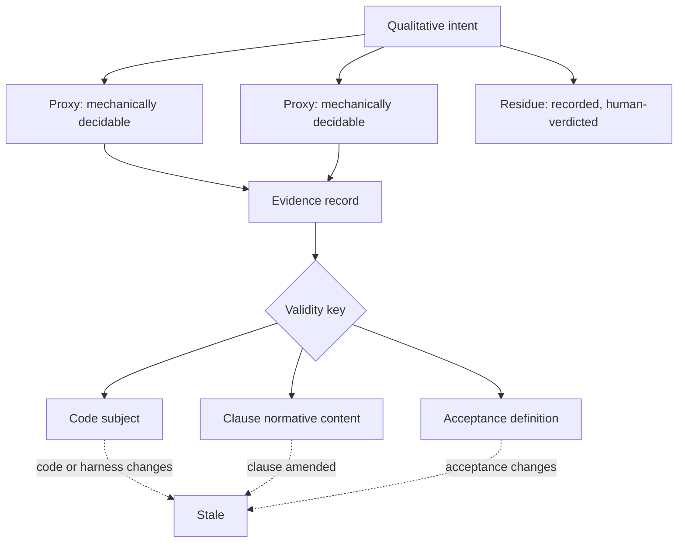

# Contract Kernel v1 - Plan

## Goal Capsule

- **Objective:** Answer one question with evidence — does a contract outlive the changes that satisfy it? Everything here exists to produce that answer or to kill the project honestly.
- **Product authority:** Pyro signs law and verdicts residue. Docket is agent-owned per `memory/decisions/DC-0005-docket-resumes-as-a-contract-kernel-on-one-falsifiable-question.md`; Claude holds decision rights on reviewer findings. The Slipway projection and the live retrofit are named but are not active scope.
- **Open blockers:** None. Planning can proceed.

---

## Product Contract

### Summary

A contract-and-evidence kernel narrow enough to test one claim: that an obligation survives the changes that satisfy it. Evidence binds to the exact code state it was produced against, so amending one clause stales only that clause's evidence while everything else carries forward. The first real obligation in the ledger is "don't overengineer," compiled as intent plus mechanically decidable proxies plus recorded residue, governing docket's own build.

### Problem Frame

Obligations that must hold across many changes have no home. A change-scoped tool creates requirements while planning a change and archives them when the change completes; the obligation dies with the work that satisfied it. What survives instead is repetition — the rule gets restated into each new agent's context, and restatement is not enforcement.

The live example is in this ecosystem already. "Don't overengineer" sits in the user's global instruction file as the key directive, in prose, and still has to be said out loud to agents. It is a conventionally suggested discriminator rather than a structurally enforced one, so it degrades to repetition. That degradation is survivable at one-human scale and not at agent scale: when agents outnumber the humans available to review them, an obligation that survives only by being restated does not survive.

Docket was stopped in June on the conclusion that a mature lifecycle governor already served this need. That conclusion came from comparing features — a governed change's requirement and a persistent obligation's clause can carry the same sentence — rather than comparing lifetimes. The falsifier applied at the time asked whether the contract layer had a consumer no larger tool could serve, which a boundary artifact cannot satisfy by construction. It produced no result, and the no-result was filed as a negative.

### Key Decisions

- KD1. **Resume as a contract-and-evidence kernel, not a lifecycle framework.** (session-settled: user-approved — chosen over closing the project and distilling the methodology: the June stop rested on a falsifier that could not fail.) Governs R5, R6, R7, R8.
- KD2. **Scope to one question rather than a kernel roadmap.** (session-settled: user-approved — chosen over an eight-PR sequence that reaches the decisive test only at the end.) Governs R12, R15.
- KD3. **Code obligations before harness obligations.** Testing where the oracle is a passing test isolates the mechanism from oracle noise; a failure under a judge-shaped oracle is ambiguous between ledger and judge. (session-settled: user-approved — chosen over reviving the agent-harness target: its premise came from the same broken seam hunt.) Governs R12, R14.
- KD4. **Bench test first, self-governed build second, live retrofit held.** (session-settled: user-approved — chosen over starting with the live retrofit: a synthetic failure has exactly one possible cause.) Governs R12, R13, R14.
- KD5. **A qualitative obligation decomposes rather than being refused at the door.** The admission rule demanding a number was right to reject the prose and wrong to leave it homeless. (session-settled: user-approved.) Governs R9, R10, R11.
- KD6. **Docket is agent-owned; Claude resolves reviewer findings.** (session-settled: user-directed.)
- KD7. **Substrate honesty removes the signature claim rather than building an approval command.** Evidence keys on clause content, so editing a clause stales its evidence with or without a signature; the experiment needs no approval step. (session-settled: user-directed — chosen over building a minimal approval bound to the contract digest: that expands v1 past the scoped question.) Governs R1.

The diagram shows why one clause's amendment does not invalidate its neighbours: validity keys on the clause's own content, not on the contract's global revision.

### Actors

- A1. **Authority** — sets the obligation, signs law, verdicts residue. Never files evidence.
- A2. **Implementer** — does the work and files evidence. Cannot verdict its own residue.
- A3. **Ledger** — admits, derives state, refuses. Judges admissibility, never quality.
- A4. **Independent verifier** — adjudicates factual claims with no sight of why anything was chosen.

### Requirements

**Substrate honesty**

- R1. The repository states nothing about its own guarantees that is not true.
- R2. Anchor vocabulary has exactly one source, shared by the runtime and both producer skills.
- R3. A command-kind acceptance whose process exits zero while violating its stated expectation is reported failing.
- R4. Import is atomic — any refusal means nothing becomes law.

**Evidence binding**

- R5. A filed evidence record names the exact code state it was produced against.
- R6. Evidence validity keys on the clause's own normative content, not on the contract's global revision.
- R7. Changing production code or an acceptance harness stales the evidence that depended on it, and writing an evidence record does not stale itself.
- R8. A mechanically checkable clause is never reported holding without current passing mechanical evidence, regardless of any accepted verdict.

**Obligation shape**

- R9. A qualitative intent enters the ledger as intent plus at least one mechanically decidable proxy.
- R10. What the proxies do not cover is recorded on the clause rather than omitted.
- R11. A human-verdict clause names the residue it covers and the authority who verdicts it.

**The experiment**

- R12. One contract governs two successive changes, and the second change's outcome is recorded.
- R13. Each fault injection produces a distinct named state and a message that says what to do about it.
- R14. Docket's own build is governed by a contract carrying the overengineering obligation.
- R15. The run ends in a written go/no-go against the kill conditions in DC-0005.

### Key Flows

- F1. Bench run over the existing fixture
  - **Trigger:** Substrate honesty requirements are satisfied.
  - **Actors:** A1, A2, A3
  - **Steps:** Import the existing contract; implement change A; file evidence; observe clauses holding; implement change B touching a subset; observe untouched clauses carrying forward and touched clauses stale.
  - **Outcome:** The mechanism either discriminates or does not, with one possible cause.
  - **Covered by:** R5, R6, R7, R8, R12

- F2. Self-governed build
  - **Trigger:** F1 discriminates.
  - **Actors:** A1, A2, A3
  - **Steps:** Compile the overengineering obligation as intent plus proxies plus residue; admit it; each change in the kernel's own build files evidence against it; the authority verdicts the residue.
  - **Outcome:** Multi-change survival evidence produced as a byproduct of building, on the obligation the authority actually wants enforced.
  - **Covered by:** R9, R10, R11, R14

- F3. Fault injection
  - **Trigger:** Runs against both F1 and F2.
  - **Actors:** A2, A3
  - **Steps:** Introduce each seeded fault; read the resulting state; compare against the expected state.
  - **Outcome:** The ledger's discrimination is measured rather than assumed.
  - **Covered by:** R13

### Acceptance Examples

- AE1. **Covers R7.** Given a clause holding on filed evidence, when a production file it depends on changes, then the clause reports stale rather than holding.
- AE2. **Covers R7.** Given a clause holding on filed evidence, when an evidence record is written, then the clause does not stale itself.
- AE3. **Covers R6.** Given a contract where one clause is amended, when state is derived, then only the amended clause's evidence is invalidated and unchanged clauses stay admissible.
- AE4. **Covers R5.** Given evidence produced against one commit, when it is offered for a different commit, then it is visible in the ledger and inadmissible for the current subject.
- AE5. **Covers R8.** Given a mechanically checkable clause with a failing check, when a human accepts the evidence bundle, then the clause does not report holding.
- AE6. **Covers R8.** Given an evidence bundle containing no evidence, when it is accepted, then no clause reports holding on it.
- AE7. **Covers R3.** Given a command acceptance whose process exits zero but produces output violating its stated expectation, when the check runs, then the result is failing.
- AE8. **Covers R4.** Given a contract where one clause is refused at the door and others are admitted, when it is imported, then nothing is written.
- AE9. **Covers R2.** Given a contract emitted by either producer skill without hand-editing, when it is imported, then no clause is refused for an unrecognised anchor type.
- AE10. **Covers R13.** Given a deleted acceptance harness, when the gate runs, then the clause reports a distinct state naming the missing harness rather than passing.
- AE11. **Covers R12, R14.** Given an obligation admitted before change A, when change B is planned without mentioning it, then the obligation is still visible as active law.

### Success Criteria

The run continues past v1 only if a contract meaningfully governs both changes, subject binding catches stale or misapplied evidence, selective clause amendment works, and the authority's involvement concentrates on residue rather than on every passing check.

The run stops or narrows if any kill condition in DC-0005 fires. Those conditions are authoritative there and are not restated here; R15 requires the go/no-go to be written against them by name.

### Scope Boundaries

**Deferred for later**

- The deterministic projection into a lifecycle tool, and the lock that prevents the projection becoming an editable authority.
- The live retrofit onto an actively developed repository — the strongest evidence and the worst first move while the mechanism is unproven.
- Gate profiles, generated schema, cryptographic signing infrastructure, evidence-policy enforcement beyond what R10 requires.
- Harness and skill obligations as the governed artifact class.

**Outside this product's identity**

- The courtroom as originally scoped. Cut in June, stays cut.
- Repository exploration, implementation planning, task databases, worktrees, agent spawning, review orchestration, repair loops, deployment, and any second definition of done.

<!-- ce-section: work-relationships -->
### How This Work Fits Together

This plan owns the kernel experiment. The breakdown below is the current understanding, not a committed roadmap; a later plan may revise, split, merge, or discard any of it.

- Kernel experiment (this plan)
  - Enables the lifecycle-tool projection — the projection is only worth building if obligations survive changes.
  - Enables the live retrofit, which depends on a mechanism that discriminates.
- Lifecycle-tool projection
  - Depends on the kernel experiment.
  - Shares the clause identity and digest work with this plan.
- Live retrofit onto an actively developed repository
  - Depends on both of the above.
  - Still to decide — whether the obligation source is that repository's own history or an external authority unrelated to its current work.
- Harness and skill obligations
  - Can proceed independently of the projection.
  - Still to decide — whether the evaluator problem is tractable at all, which is unresolved in Dependencies below.

### Dependencies / Assumptions

- **Load-bearing and unresolved:** no non-human signal is currently known for irreducibly qualitative obligations. The authority was asked directly and answered "I don't know." The proxy-plus-residue shape holds this question rather than answering it; if no such signal exists, the harness direction has a hole in it that this plan does not close.
- Proxies are gameable. Keeping them honest requires the authority to review a sample, which is a weaker promise than the scale argument asks for — the authority stops reviewing everything, not everything.
- Passing tests pin the behaviour R4 and R8 change, so a green suite here is a baseline rather than correctness. `tests/test_import.py::test_refusals_cite_door_checks` asserts a success exit code when at least one clause is admitted, citing design decision 11 — R4 therefore reverses a recorded decision rather than repairing an oversight, and that decision record needs updating alongside the code. `tests/test_tasks_file.py::test_tasks_clear_when_all_green` asserts a clear result from an accepted bundle whose evidence list is empty and for which no check exists; the test name asserts greenness its own fixture never establishes.
- The existing fixture imports cleanly through the door, and the door has not changed since it did.

### Outstanding Questions

**Deferred to Planning**

- Which specific proxies compile the overengineering obligation, and how they are chosen so they are not trivially gamed.
- Subject granularity — whether a commit identity suffices or a workspace identity is needed for uncommitted work.
- Whether the fault-injection set is exactly the one in DC-0005 or extended.

### Sources / Research

- `memory/decisions/DC-0005-docket-resumes-as-a-contract-kernel-on-one-falsifiable-question.md` — the resume decision, six confirmed trust defects, and the kill conditions this plan is measured against.
- `memory/decisions/DC-0003-slipway-wins-lifecycle-docket-narrows-to-contract-layer.md` and `memory/decisions/DC-0004-docket-is-policy-layer-of-agent-harness-cicd-caliper-is-sensor.md` — the superseded reasoning trail, kept because the seam-hunt finding in DC-0003 is still true even though its inference is not.
- `docs/concepts/01-contract-schema-and-door-policy.md` — the admission rules this plan works with rather than around.
- `memory/threads/TH-0001-v0-build-path.md` — closed, but its hollow-oracle watch item names R3's defect in advance.
