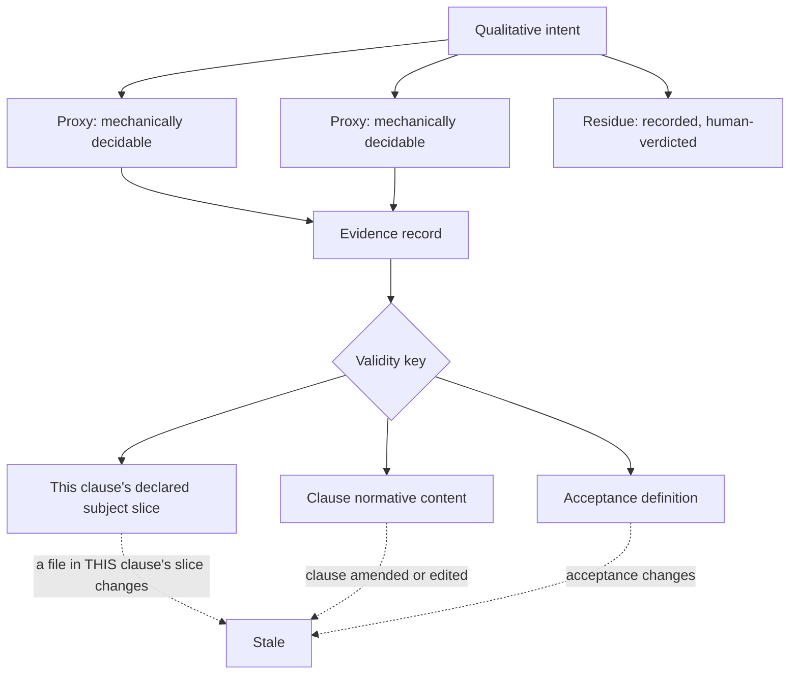
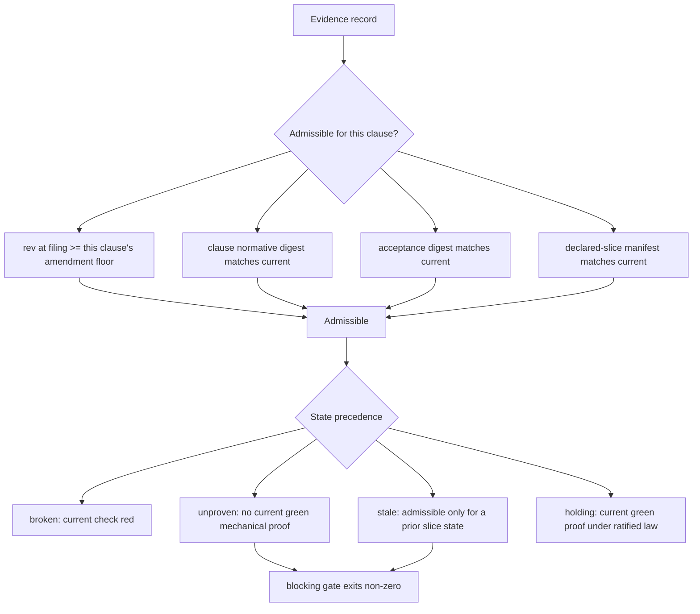

# Contract Kernel v1 - Plan

## Goal Capsule

- **Objective:** Answer one question with evidence — does a contract outlive the changes that satisfy it? Everything here exists to produce that answer or to kill the project honestly.
- **Product authority:** Pyro signs law and verdicts residue. Docket is agent-owned per `memory/decisions/DC-0005-docket-resumes-as-a-contract-kernel-on-one-falsifiable-question.md`; Claude holds decision rights on reviewer findings. The Slipway projection and the live retrofit are named but are not active scope.
- **Authority hierarchy:** The Product Contract wins on product behavior. A Key Technical Decision wins on implementation mechanism within its cited requirements. Units override neither. Pyro signs law and verdicts residue; Claude implements and files evidence and cannot verdict its own residue.
- **Execution profile:** Twelve units. U1–U4 repair the substrate. U10 freezes the bench before the mechanism exists. U5–U7 and U11 build the mechanism. U8 freezes the obligation. U12 is the first change the obligation actually governs. U9 runs and writes the verdict.
- **Stop conditions:** Stop and report rather than working around it if any DC-0005 kill condition fires; if the bench is modified after freezing; if a proxy cannot be made mechanically decidable; or if updating a pinned test would require weakening what it asserts rather than correcting what it asserts.
- **Tail ownership:** No PR. Work lands on a branch off `main`; the go/no-go in U9 is the deliverable, not a merge.
- **Open blockers:** None.
- **Product Contract preservation:** **changed** — R5, R7, R13, and R14 rewritten; R16–R19 added. An external review (`docs/reviews/2026-07-26-codie-external-review-contract-kernel-v1.md`) established that the original global-subject design cannot distinguish evidence that survived a change from evidence that was re-proved after it, which is the question the experiment exists to answer. R6 stands as written.

---

## Product Contract

### Summary

A contract-and-evidence kernel narrow enough to test one claim: that an obligation survives the changes that satisfy it. Each clause binds its evidence to its own declared slice of the code, so a change touching one clause leaves its neighbours' evidence admissible rather than re-proved. The first real obligation in the ledger is "don't overengineer," compiled as intent plus mechanically decidable proxies plus recorded residue, and it governs at least one kernel change made after it exists.

### Problem Frame

Obligations that must hold across many changes have no home. A change-scoped tool creates requirements while planning a change and archives them when the change completes; the obligation dies with the work that satisfied it. What survives instead is repetition — the rule gets restated into each new agent's context, and restatement is not enforcement.

The live example is in this ecosystem already. "Don't overengineer" sits in the user's global instruction file as the key directive, in prose, and still has to be said out loud to agents. It is a conventionally suggested discriminator rather than a structurally enforced one, so it degrades to repetition. That degradation is survivable at one-human scale and not at agent scale: when agents outnumber the humans available to review them, an obligation that survives only by being restated does not survive.

Docket was stopped in June on the conclusion that a mature lifecycle governor already served this need. That conclusion came from comparing features — a governed change's requirement and a persistent obligation's clause can carry the same sentence — rather than comparing lifetimes. The falsifier applied at the time asked whether the contract layer had a consumer no larger tool could serve, which a boundary artifact cannot satisfy by construction. It produced no result, and the no-result was filed as a negative.

### Key Decisions

- KD1. **Resume as a contract-and-evidence kernel, not a lifecycle framework.** (session-settled: user-approved — chosen over closing the project and distilling the methodology: the June stop rested on a falsifier that could not fail.) Governs R5, R6, R7, R8.
- KD2. **Scope to one question rather than a kernel roadmap.** (session-settled: user-approved — chosen over an eight-PR sequence that reaches the decisive test only at the end.) Governs R12, R15.
- KD3. **Code obligations before harness obligations.** Testing where the oracle is a passing test isolates the mechanism from oracle noise; a failure under a judge-shaped oracle is ambiguous between ledger and judge. (session-settled: user-approved — chosen over reviving the agent-harness target: its premise came from the same broken seam hunt.) Governs R12, R14.
- KD4. **Bench test first, self-governed build second, live retrofit held.** (session-settled: user-approved — chosen over starting with the live retrofit: a synthetic failure has exactly one possible cause.) Governs R12, R13, R17.
- KD5. **A qualitative obligation decomposes rather than being refused at the door.** The admission rule demanding a number was right to reject the prose and wrong to leave it homeless. (session-settled: user-approved.) Governs R9, R10, R11.
- KD6. **Docket is agent-owned; Claude resolves reviewer findings.** (session-settled: user-directed.)
- KD7. **Substrate honesty removes the signature claim rather than building an approval command.** The experiment needs no approval step. It does need the repository to state the trust model that replaces the removed claim, because "admission is the only gate" is not a trust model. (session-settled: user-directed — chosen over building a minimal approval bound to the contract digest: that expands v1 past the scoped question.) Governs R1, R19.

The subject is per clause, not per repository. A change inside one clause's slice leaves every other clause's evidence admissible — that difference is what makes carry-forward observable rather than inferred.

### Actors

- A1. **Authority** — sets the obligation, signs law, verdicts residue. Never files evidence.
- A2. **Implementer** — does the work and files evidence. Cannot verdict its own residue.
- A3. **Ledger** — admits, derives state, refuses. Judges admissibility, never quality.
- A4. **Independent verifier** — adjudicates factual claims with no sight of why anything was chosen.

### Requirements

**Substrate honesty**

- R1. The repository states nothing about its own guarantees that is not true.
- R2. Anchor vocabulary has one canonical source, and any divergence between it and a producer's published list fails a check.
- R3. A command-kind acceptance whose process exits zero while violating its stated expectation is reported failing.
- R4. Import is atomic — any refusal means nothing becomes law.
- R19. The repository states the trust model under which contract commands execute, including that admitted law is trusted executable code and that import is schema admission rather than authentication.

**Evidence binding**

- R5. A filed evidence record names the clause's own declared subject slice and the content state of that slice when the check ran.
- R6. Evidence validity keys on the clause's own normative content, not on the contract's global revision.
- R7. Changing a file inside a clause's declared subject slice stales that clause's evidence and no other clause's, and writing an evidence record stales nothing.
- R8. A mechanically checkable clause is never reported holding without current passing mechanical evidence, regardless of any accepted verdict.
- R16. A blocking gate invocation fails for every active mechanical clause lacking current green proof, including clauses reported `pending-harness` or `unproven`.

**Obligation shape**

- R9. A qualitative intent enters the ledger as intent plus at least one clause whose acceptance is structured and executable.
- R10. What the proxies do not cover is recorded as a residue clause on the same intent.
- R11. A human-verdict clause names the residue it covers and the authority who verdicts it.

**The experiment**

- R12. One contract governs two successive changes, and the second change's outcome is recorded.
- R13. Every fault injection has a preregistered expected outcome — observable, exit code, derived state, and message — and the run records actual against expected.
- R14. At least one kernel change is made after the overengineering contract is frozen, under a gate that can block it, and what the contract constrained in that change is recorded.
- R15. The run ends in a written go/no-go against the kill conditions in DC-0005.
- R17. The bench is committed and frozen before the mechanism it tests is implemented: subject program, contract, both change patches, and the expected affected-clause set.
- R18. One obligation admitted before the governed change, arising from a source unrelated to it, is carried through that change without being hand-forced into scope.

### Key Flows

- F1. Bench run over the frozen bench
  - **Trigger:** The mechanism units are complete and the bench has not been edited since freezing.
  - **Actors:** A2, A3
  - **Steps:** Import the frozen contract; apply change A; file evidence; observe clauses holding; apply change B; **derive state before running any check or filing anything**; assert the original evidence record ids remain admissible for the clauses B did not touch.
  - **Outcome:** Carry-forward is observed on the original records, not inferred from fresh ones.
  - **Covered by:** R5, R6, R7, R12, R17

- F2. Governed change
  - **Trigger:** The overengineering contract is frozen (U8 complete).
  - **Actors:** A1, A2, A3
  - **Steps:** Make one real kernel change under the blocking gate; record which proxy constrained it, or record that none did; the authority verdicts the residue.
  - **Outcome:** Governance is demonstrated on work the contract could actually have refused.
  - **Covered by:** R14, R16, R18

- F3. Fault injection
  - **Trigger:** Runs against F1 and F2.
  - **Actors:** A2, A3
  - **Steps:** Introduce each seeded fault; record the observable, exit code, derived state, and message; compare against the preregistered expectation.
  - **Outcome:** The ledger's discrimination is measured against a prediction made before the run.
  - **Covered by:** R13

### Acceptance Examples

- AE1. **Covers R7.** Given clauses A and B holding, when a file inside A's declared slice changes, then A reports stale and B remains holding on its original evidence record.
- AE2. **Covers R7.** Given a clause holding on filed evidence, when an evidence record is written, then the clause does not stale itself.
- AE3. **Covers R6.** Given a contract where one clause is amended, when state is derived, then only the amended clause's evidence is invalidated.
- AE4. **Covers R5.** Given evidence produced against one content state of a clause's slice, when that slice differs, then the evidence is visible in history and inadmissible for the current subject.
- AE5. **Covers R8.** Given a mechanically checkable clause with a failing check, when a human accepts the evidence bundle, then the clause does not report holding.
- AE6. **Covers R8.** Given an evidence bundle containing no evidence, when it is accepted, then no clause reports holding on it.
- AE7. **Covers R3.** Given a command acceptance whose process exits zero but produces output violating its stated expectation, when the check runs, then the result is failing.
- AE8. **Covers R4.** Given a contract where one clause is refused at the door and others are admitted, when it is imported, then nothing is written and the exit code is non-zero.
- AE9. **Covers R2.** Given a contract emitted by either producer skill without hand-editing, when it is imported, then no clause is refused for an unrecognised anchor type.
- AE10. **Covers R16.** Given a deleted acceptance harness on an active mechanical clause, when the blocking gate runs, then it exits non-zero and names the clause.
- AE11. **Covers R12, R18.** Given an obligation admitted before the governed change from an unrelated source, when that change is planned without mentioning it, then the obligation is still active law and the gate still enforces it.
- AE12. **Covers R5, R7.** Given an acceptance command that mutates a tracked file inside its own clause's slice and exits zero, when the check completes, then the result is not admitted as green.
- AE13. **Covers R14.** Given the frozen overengineering contract, when a kernel change violates a proxy, then the gate exits non-zero and the change does not land.

### Success Criteria

The run continues past v1 only if the original evidence records for untouched clauses remain admissible across change B, subject binding catches stale and misapplied evidence, selective clause amendment works, at least one governed change was constrained or provably could have been, and the authority's involvement concentrates on residue rather than on every passing check.

The run stops or narrows if any kill condition in DC-0005 fires. Those conditions are authoritative there and are not restated here; R15 requires the go/no-go to be written against them by name. A kill condition that was never exercised is recorded as untested, and an untested condition forbids an unqualified "go".

### Scope Boundaries

**Deferred for later**

- The deterministic projection into a lifecycle tool, and the lock that prevents the projection becoming an editable authority.
- The live retrofit onto an actively developed repository — the strongest evidence and the worst first move while the mechanism is unproven.
- Gate profiles, generated schema, cryptographic signing infrastructure, evidence-policy enforcement beyond what R10 requires.
- Harness and skill obligations as the governed artifact class.

**Outside this product's identity**

- The courtroom as originally scoped. Cut in June, stays cut. The narrow amendment and verdict path in U11 is an experiment fixture, not its revival.
- Repository exploration, implementation planning, task databases, worktrees, agent spawning, review orchestration, repair loops, deployment, and any second definition of done.

<!-- ce-section: work-relationships -->
### How This Work Fits Together

This plan owns the kernel experiment. The breakdown below is the current understanding, not a committed roadmap; a later plan may revise, split, merge, or discard any of it.

- Kernel experiment (this plan)
  - Enables the lifecycle-tool projection — the projection is only worth building if obligations survive changes.
  - Enables the live retrofit, which depends on a mechanism that discriminates.
- Lifecycle-tool projection
  - Depends on the kernel experiment.
  - Shares the clause identity and digest work with this plan.
- Live retrofit onto an actively developed repository
  - Depends on both of the above.
  - Still to decide — whether the obligation source is that repository's own history or an external authority unrelated to its current work.
- Harness and skill obligations
  - Can proceed independently of the projection.
  - Still to decide — whether the evaluator problem is tractable at all, which is unresolved in Dependencies below.

### Dependencies / Assumptions

- **Load-bearing and unresolved:** no non-human signal is currently known for irreducibly qualitative obligations. The authority was asked directly and answered "I don't know." The proxy-plus-residue shape holds this question rather than answering it; if no such signal exists, the harness direction has a hole in it that this plan does not close.
- **Declared slices can be wrong.** A clause whose declared subject slice is too narrow keeps evidence admissible after a change that should have invalidated it — a false green introduced by the fix for false carry-forward. The default slice is the acceptance target plus the runner configuration, widened explicitly; a door check requires every mechanical clause to declare at least one path. Slice correctness is not mechanically verifiable and is recorded as a residual risk of the design.
- Proxies are gameable. Keeping them honest requires the authority to review a sample, which is a weaker promise than the scale argument asks for — the authority stops reviewing everything, not everything.
- Passing tests pin the behaviour R4 and R8 change, so a green suite here is a baseline rather than correctness. `tests/test_import.py::test_refusals_cite_door_checks` asserts a success exit code when at least one clause is admitted, citing design decision 11 — R4 therefore reverses a recorded decision rather than repairing an oversight, and that decision record needs updating alongside the code. `tests/test_tasks_file.py::test_tasks_clear_when_all_green` asserts a clear result from an accepted bundle whose evidence list is empty and for which no check exists; the test name asserts greenness its own fixture never establishes.
- Git is available and the repo is not detached or bare.
- The existing graduation fixtures are import fixtures, not the bench. Their command clauses are allowed to sit at `pending-harness` for the duration of this work.

### Outstanding Questions

**Deferred to Planning**

- Which specific proxies compile the overengineering obligation, and how they are chosen so they are not trivially gamed.
- Which pre-existing obligation is chosen for R18, and from which source.
- The exact canonical serialization of the clause normative payload, within the field set KTD11 fixes.

### Sources / Research

- `docs/reviews/2026-07-26-codie-external-review-contract-kernel-v1.md` — the external review that rewrote this plan. Its P0 findings are why R5, R7, R13, R14 changed and R16–R19 exist.
- `memory/decisions/DC-0005-docket-resumes-as-a-contract-kernel-on-one-falsifiable-question.md` — the resume decision, six confirmed trust defects, and the kill conditions this plan is measured against.
- `memory/decisions/DC-0003-slipway-wins-lifecycle-docket-narrows-to-contract-layer.md` and `memory/decisions/DC-0004-docket-is-policy-layer-of-agent-harness-cicd-caliper-is-sensor.md` — the superseded reasoning trail, kept because the seam-hunt finding in DC-0003 is still true even though its inference is not.
- `docs/concepts/01-contract-schema-and-door-policy.md` — the admission rules this plan works with rather than around.
- `memory/threads/TH-0001-v0-build-path.md` — closed, but its hollow-oracle watch item names R3's defect in advance.

---

## Planning Contract

### Key Technical Decisions

- KTD1. **One canonical anchor manifest; producer documents are generated or checked against it.** The runtime tuple and two producer lists are three independently edited sources today, and a drift test detects divergence without removing it. The manifest is the source; the drift check compares each published list against it and fails on any difference. Governs R2.
- KTD2. **A command clause whose expectation is prose-only reports `pending-harness`, not refused and not green.** Refusing at the door would break the graduation fixtures, whose provenance value comes from being unedited dojo output; passing them would keep the false green R3 exists to remove. Governs R3.
- KTD3. **The evidence subject is a per-clause manifest, not a repository-wide workspace digest.** A global digest stales every clause on any change, so re-running checks after change B produces fresh records that read as carry-forward when nothing carried forward — the experiment could report success without the claim being true. The subject is a sorted manifest of path, mode, and content hash over the clause's declared slice, plus its acceptance harness and runner configuration. HEAD is recorded separately as provenance, not as identity, so staging or committing identical bytes does not change the subject. Governs R5, R7.
- KTD4. **Clause-content digests supplement the existing per-clause amendment floor rather than replacing it.** Validity already filters amendments by clause id, so one clause's amendment already leaves its neighbours' evidence admissible — confirmed against `src/docket/storage.py:96` and `src/docket/state.py:43`. The unmet half is that editing the contract file without recording an amendment leaves evidence valid. Governs R6.
- KTD5. **Obligation decomposition uses contract-level intents that clauses implement.** One clause carrying several acceptances would break the atomicity rule the door enforces. An intent requires at least one implementing clause whose acceptance is structured and executable — a prose-only command does not qualify, since U3 makes it `pending-harness` — and requires a residue clause. There is no no-residue escape: an intent that claims full mechanical coverage is claiming the qualitative statement was never qualitative. Governs R9, R10, R11.
- KTD6. **The self-governed build blocks rather than observes.** A proxy failure stops the change that violated it. Observation would produce a record nobody is obliged to act on, which is the conventionally-suggested discriminator this project exists to replace. (session-settled: user-approved — chosen over recording proxy results without gating: gated failure is the honest test and blocking bites the implementer mid-build, which is the point.) Governs R14, R16.
- KTD7. **Atomic import reverses design decision 11, and the decision record is amended in the same unit.** `docs/plans/2026-06-12-docket-v0-plan-1-ledger-door-state.md:29` records exit 0 on partial admission as intended behavior. Changing the code without amending that record would leave two live decisions in conflict — the second-spec-reality failure this project is named against. Governs R4.
- KTD8. **The subject is captured before and after acceptance execution, and green requires both to match.** A command that mutates a tracked file in its own slice and exits zero would otherwise bind a green result to a state that was never checked. A mismatch records a distinct "workspace mutated during acceptance" failure rather than a pass. Governs R5, R7.
- KTD9. **Verdict validity is separated from evidence validity.** If subject validity applied to verdicts, every change would force the authority to re-verdict every mechanical clause, contradicting the success criterion that authority effort concentrates on residue. If verdicts stayed revision-only, an accepted verdict tied to a stale bundle could combine with a fresh check to produce holding. So: a mechanical clause derives holding from current green proof under ratified law; a human-residue clause derives holding from a current human verdict; a verdict never transfers to a bundle it was not issued against. Governs R8.
- KTD10. **The trust model is stated, not implied.** Admitted contract YAML is trusted executable code running with the caller's privileges; import is schema admission, not authentication or safety review; only locally reviewed sources may be checked. The import report describes any `signed` entries as unverified declarations. No cryptography is added. Governs R19.
- KTD11. **The clause normative payload is fixed: obligation, acceptance, status, risk, evidence requirements, and scope.** Notes, anchors, and formatting are excluded, so an editorial change does not stale evidence and a substantive one does. Governs R6.
- KTD12. **U1–U8 and U10–U11 are bootstrap; only U12 is governed.** Authoring proxies from file lists the earlier units already produced would make them pass by construction and let the completion criteria claim governance that never constrained anything. The contract is frozen at U8 and the first change it can refuse is U12. Nothing claims the contract governed code written before the contract existed. Governs R14.

### High-Level Technical Design

Evidence currently passes a single revision floor. It will pass a four-part predicate, and the state chain gains one state between `overlap` and `holding`.

All four parts must hold. Failing only the slice part yields `stale`, so the ledger distinguishes "never proven" from "proven against something else". `unproven` and `stale` both fail the blocking gate — a gate that passes on absence of proof is not a gate.

### Assumptions

- The bench, once frozen, is not edited. If it must change, the run is void and restarts from a new freeze.
- The declared-slice default (acceptance target plus runner configuration) is correct for most clauses. Where it is not, the clause widens it explicitly. See the residual risk in Dependencies.

### Sequencing

U1–U4 repair the substrate and are independent of one another. **U10 freezes the bench before U5 begins** — the prediction must exist before the mechanism that will be judged against it, or the run can be shaped to pass. U5 introduces per-clause subject identity and unblocks U6; U6 rewires validity and unblocks U7; U7 removes the false-clear path and makes the gate fail closed. U11 adds the two write operations the run needs. U8 freezes the obligation. U12 is the first change that obligation can refuse. U9 runs the frozen bench and writes the verdict.

Unit numbering is stable, so U10 and U11 read out of numeric order; the Unit Index gives dependency order.

---

## Implementation Units

| U-ID | Title | Key files | Depends on |
|---|---|---|---|
| U1 | Remove the signature claim, state the trust model | `runner.py`, `render.py`, `CLAUDE.md`, `README.md` | — |
| U2 | One canonical anchor manifest | `model.py`, both producer references | — |
| U3 | Make command acceptance discriminate | `model.py`, `runner.py` | — |
| U4 | Make import atomic | `cli.py`, plan doc carrying decision 11 | — |
| U10 | Freeze the preregistered bench | `fixtures/bench/` | — |
| U5 | Per-clause subject manifest | `subject.py`, `model.py` | U10 |
| U6 | Bind evidence to slice and clause content | `storage.py`, `state.py`, `cli.py` | U5 |
| U7 | Holding requires proof; the gate fails closed | `state.py`, `cli.py`, `render.py` | U6 |
| U11 | Minimal amendment and verdict path | `cli.py`, `storage.py` | U6 |
| U8 | Compile and freeze the overengineering obligation | `model.py`, `accord.py`, `.contracts/` | U2, U6 |
| U12 | One governed kernel change | any kernel file, `.contracts/` | U8, U11 |
| U9 | Run the bench, inject faults, write the verdict | `docs/runs/`, `memory/decisions/` | U7, U9's predecessors, U12 |

### U1. Remove the signature claim and state the trust model

- **Goal:** The repository stops asserting guarantees it cannot deliver, and says what is actually true instead.
- **Requirements:** R1, R19
- **Dependencies:** none
- **Files:** `src/docket/runner.py`, `src/docket/render.py`, `CLAUDE.md`, `README.md`, `tests/test_import.py`
- **Approach:** Delete the runner docstring's claim that the signature is the trust boundary. Replace it with the trust model from KTD10 rather than with "admission is the only gate" — admission is schema validation, not authentication, and calling it a gate repeats the original error in weaker words. Remove the `sign with: docket sign` pointer; describe any `signed` entries in the import report as unverified declarations. Correct `CLAUDE.md`'s "Concept phase — no code yet" and the README equivalent.
- **Test scenarios:**
  - The import report for an unsigned contract names no command that does not exist.
  - The import report describes a `signed` entry as an unverified declaration.
  - An existing test asserting the removed report text is updated to assert the replacement, not deleted.
- **Verification:** No occurrence of `docket sign` outside historical decision records, and the trust model is stated where a reader meets the runner.

### U2. Establish one canonical anchor manifest

- **Goal:** A contract emitted by either producer skill imports without hand-editing, and the vocabulary cannot fork again.
- **Requirements:** R2
- **Dependencies:** none
- **Files:** `src/docket/model.py`, `.agents/skills/contract-first-development/SKILL.md`, `.agents/skills/surface-first-development/references/contract-emission.md`, `tests/test_model.py`
- **Approach:** Make one manifest the source of the anchor vocabulary — the union of the six runtime types and the four the contract-first skill teaches, per KTD1. Producer documents cite or derive from it; a check compares each published list against the manifest and fails on any difference. Three synchronized copies with a drift test is the fallback only if generation proves disproportionate, and the requirement text says "one canonical source" for that reason.
- **Patterns to follow:** The existing exactly-one-key validator on the anchor model; extend its field set rather than changing its shape.
- **Test scenarios:**
  - A clause anchored `policy:` imports and is admitted.
  - A clause anchored with a type absent from the manifest is refused.
  - The check fails when the manifest gains a type a producer list lacks.
  - The check fails when a producer list names a type the manifest lacks.
- **Verification:** The clause that reproduced the `[A7] schema: Extra inputs are not permitted` refusal imports clean.

### U3. Make command acceptance discriminate

- **Goal:** A command that exits zero while violating its stated expectation reports failing.
- **Requirements:** R3
- **Dependencies:** none
- **Files:** `src/docket/model.py`, `src/docket/runner.py`, `tests/test_exec.py`
- **Approach:** Give the command acceptance a structured expectation carrying an expected exit code and optional stdout and stderr patterns. Evaluate it in the runner instead of interpolating it into a message. A prose-only expectation returns `pending-harness` naming the expectation as not machine-checkable, per KTD2.
- **Patterns to follow:** The metric branch of `run_acceptance` already implements a real oracle — parse the contracted bound, match against output, compare, return `red` with drift naming measured-versus-contracted. Mirror that shape.
- **Execution note:** Write the failing case first. This unit exists because an oracle asserted nothing while reporting green, so the test that proves the fix must be watched failing before the fix lands.
- **Test scenarios:**
  - A command exiting 0 whose stdout does not match reports red, with drift naming the mismatch.
  - A command exiting 0 whose stdout matches reports green.
  - A command exiting non-zero reports red regardless of pattern.
  - A prose-only expectation reports pending-harness.
  - A timeout still reports red rather than crashing.
- **Verification:** No path through the command branch returns green on exit code alone.

### U4. Make import atomic

- **Goal:** A refusal at the door means nothing becomes law.
- **Requirements:** R4
- **Dependencies:** none
- **Files:** `src/docket/cli.py`, `tests/test_import.py`, `docs/plans/2026-06-12-docket-v0-plan-1-ledger-door-state.md`
- **Approach:** Write law only when the refusal list is empty; report refusals with their cited checks as now and exit non-zero. Amend design decision 11 in the plan document that records it, per KTD7.
- **Execution note:** Two tests assert exit 0 on partial admission and pin that behavior deliberately. Update what they assert; do not delete them. The behavior is being reversed on the record, not discovered to be a bug.
- **Test scenarios:**
  - A contract with one refused and several admitted clauses writes nothing and exits non-zero.
  - The refusal report still cites each failing check by name.
  - A fully admissible contract still imports and exits 0.
  - A cross-contract clause id collision still refuses without writing.
- **Verification:** No filesystem write occurs on any import that produced a refusal.

### U10. Freeze the preregistered bench

- **Goal:** The prediction exists before the mechanism that will be judged against it.
- **Requirements:** R13, R17
- **Dependencies:** none
- **Files:** `fixtures/bench/` (subject program, contract, `change-a.patch`, `change-b.patch`, `expected.md`)
- **Approach:** Commit a small working subject program with real passing tests, a contract over it whose clauses declare their slices, and two frozen patches. Record before any mechanism exists: which clauses change B is expected to stale, which are expected to carry forward on their original evidence record ids, and for each fault injection the expected observable, exit code, derived state, and message. State the prohibition explicitly — between applying change B and observing state, no check may run and no evidence may be filed. The graduation fixtures are not the bench; they reference absent harnesses and their command clauses go `pending-harness` under U3.
- **Execution note:** This unit lands and is committed before U5 begins. If the bench is edited after freezing, the run is void.
- **Test scenarios:**
  - The bench program's own tests pass standalone.
  - The bench contract imports clean through the door as it exists at freeze time.
  - Both patches apply cleanly in sequence.
- **Verification:** The bench is committed, its expectations are written, and its commit precedes the first commit of U5.

### U5. Per-clause subject manifest

- **Goal:** Each clause can name the slice of the repository its evidence depends on.
- **Requirements:** R5
- **Dependencies:** U10
- **Files:** `src/docket/subject.py`, `src/docket/model.py`, `tests/test_subject.py`
- **Approach:** Add an optional declared path set to the clause model, defaulting to the acceptance target plus runner configuration. Compute the subject as a sorted manifest of path, mode, and content hash over that slice, per KTD3 — content identity, not patch identity, so staging or committing identical bytes does not change it. Record HEAD separately as provenance. Add a door check requiring every mechanical clause to resolve to at least one path.
- **Test scenarios:**
  - Two calls with no intervening change produce the same manifest.
  - Staging an unchanged file does not change the manifest.
  - Editing a file inside the slice changes it; editing a file outside does not.
  - Editing the acceptance harness changes it.
  - Writing under the evidence, amendment, or draft directories does not change any clause's manifest.
  - A clause whose declared slice resolves to nothing is refused at the door.
- **Verification:** Two clauses with disjoint slices produce manifests that move independently.

### U6. Bind evidence to slice and clause content

- **Goal:** Evidence stops being admissible when what it proved has moved, and only then.
- **Requirements:** R5, R6, R7
- **Dependencies:** U5
- **Files:** `src/docket/storage.py`, `src/docket/state.py`, `src/docket/cli.py`, `tests/test_state.py`, `tests/test_storage.py`
- **Approach:** Record the clause's subject manifest, normative digest, and acceptance digest on every check and bundle. Capture the subject before execution and again after, admitting green only when both match, per KTD8; a mismatch records a distinct mutated-during-acceptance failure. Extend the validity predicate to the four parts in the design diagram. The normative payload is the fixed field set in KTD11. Evidence failing only the slice part becomes `stale`.
- **Patterns to follow:** `_valid` and `last_amend_rev` already express validity as a predicate over a record; extend that predicate rather than adding a parallel path.
- **Test scenarios:**
  - A file edit inside clause A's slice stales A and leaves B holding **on B's original record id**.
  - Filing an evidence record stales nothing.
  - Amending one clause leaves an unrelated clause's evidence admissible.
  - Editing a clause's obligation directly, with no amendment recorded, stales that clause.
  - Editing a clause's notes does not stale it.
  - A command that mutates a file in its own slice and exits zero is not admitted green.
  - Evidence carrying a prior slice state is visible in history and inadmissible now.
- **Verification:** The carry-forward scenario is asserted on record identity, not on a clause merely reporting holding.

### U7. Holding requires proof, and the gate fails closed

- **Goal:** Neither an accepted verdict nor an absence of evidence can make a clause look proven.
- **Requirements:** R8, R16
- **Dependencies:** U6
- **Files:** `src/docket/state.py`, `src/docket/cli.py`, `src/docket/render.py`, `tests/test_state.py`, `tests/test_tasks_file.py`, `tests/test_check.py`
- **Approach:** Add `unproven` between `overlap` and `holding`. A mechanical clause reaches `holding` only with current green proof under ratified law; a human-residue clause reaches it from a current human verdict; a verdict never transfers to a bundle it was not issued against, per KTD9. Change the CLI failure predicate so a blocking invocation exits non-zero for every active mechanical clause not currently green — including `pending-harness` and `unproven`. Without this the gate passes on absence of proof and KTD6's "blocks rather than observes" is not true.
- **Execution note:** One test asserts a clear result from an accepted bundle with an empty evidence list and no check, under a name claiming greenness its fixture never establishes. Correct both the assertion and the name.
- **Test scenarios:**
  - An accepted verdict with a current green check reports holding.
  - An accepted verdict with no check reports unproven.
  - An accepted verdict with a red check still reports broken.
  - A human-verdict clause with a current verdict reports holding.
  - A verdict issued against one bundle does not make a different bundle holding.
  - A deleted harness makes the blocking invocation exit non-zero and name the clause.
  - An unproven clause makes the blocking invocation exit non-zero.
- **Verification:** No blocking invocation exits zero while any active mechanical clause lacks current green proof.

### U11. Minimal amendment and verdict path

- **Goal:** The run can amend a clause and record a verdict without hand-editing ledger files.
- **Requirements:** R12, R14
- **Dependencies:** U6
- **Files:** `src/docket/cli.py`, `src/docket/storage.py`, `tests/test_amend_verdict.py`
- **Approach:** Add two narrow validated operations: amend a clause, writing the amendment record the validity floor already reads; and record a verdict against a named bundle. Change B needs the first and the residue needs the second, and without them the implementer edits YAML and history JSON by hand — bypassing the admission and provenance behavior the experiment is measuring. This is an experiment fixture, not the cut courtroom: no review workflow, no queues, no signing.
- **Test scenarios:**
  - Amending a clause writes an amendment record naming that clause and no other.
  - Amending stales that clause's evidence and no other clause's.
  - A verdict names the bundle it is issued against.
  - A verdict against a nonexistent bundle is refused.
  - Neither operation writes law that would fail the door.
- **Verification:** The bench run completes without any hand-edit to a file under `.contracts/`.

### U8. Compile and freeze the overengineering obligation

- **Goal:** The obligation Pyro wants enforced exists as admitted law, frozen before anything it governs.
- **Requirements:** R9, R10, R11
- **Dependencies:** U2, U6
- **Files:** `src/docket/model.py`, `src/docket/accord.py`, `src/docket/render.py`, `.contracts/docket.contract.yaml`, `scripts/acceptance/`, `tests/test_door.py`
- **Approach:** Add contract-level intents that clauses implement, per KTD5. Door checks: an intent requires at least one implementing clause whose acceptance is structured and executable — a prose-only command does not satisfy it — and requires a residue clause that is `verdict: human` and names its authority. There is no no-residue escape. Author the docket contract and freeze it; its proxies must be decidable against changes that do not exist yet, so they are stated as rules rather than as lists of files already written.
- **Test scenarios:**
  - An intent implemented only by a prose-only command clause is refused.
  - An intent with no residue clause is refused.
  - A residue clause that is not `verdict: human` is refused.
  - A residue clause not naming its authority is refused.
  - The docket contract imports clean through its own door.
  - Each proxy fails when its violation is seeded.
- **Verification:** The contract is admitted law, every proxy has been watched failing on a seeded violation, and the contract file is committed before U12 begins.

### U12. One governed kernel change

- **Goal:** Demonstrate governance on work the contract could actually have refused.
- **Requirements:** R14, R16, R18
- **Dependencies:** U8, U11
- **Files:** whichever kernel files the chosen change touches; `.contracts/`
- **Approach:** Pick one real, useful kernel change and make it under the blocking gate, per KTD12. Record which proxy constrained it, or record explicitly that none did — a change no proxy could have refused is not evidence of governance. Admit one obligation from a source unrelated to this change before starting it, per R18, and confirm the gate still enforces it when the change is planned without reference to it. Everything before this unit is bootstrap and nothing claims otherwise.
- **Execution note:** Seed one deliberate proxy violation and confirm the gate blocks it before making the real change. A gate never observed refusing anything has not been shown to block.
- **Test scenarios:** Not applicable — this unit exercises the system. Its acceptance is the recorded gate outcome.
- **Verification:** The gate was observed refusing at least one change, and the unrelated obligation was active and enforced throughout.

### U9. Run the bench, inject the faults, write the verdict

- **Goal:** The question gets an answer.
- **Requirements:** R12, R13, R15
- **Dependencies:** U7, U11, U12
- **Files:** `docs/runs/2026-07-26-contract-kernel-bench/`, `memory/decisions/`
- **Approach:** Import the frozen bench contract. Apply change A, file evidence, confirm holding. Apply change B, then **derive state before running any check or filing anything**, and assert the original evidence record ids remain admissible for the clauses the freeze predicted would carry forward. Run each fault injection and record actual observable, exit code, state, and message against the preregistered expectation. Write the go/no-go against DC-0005's kill conditions by name, marking any condition the run did not exercise as untested.
- **Execution note:** Record what happened before deciding what it means. The run's value is that the outcome is not under the author's control.
- **Test scenarios:** Not applicable — this unit runs the system. Its acceptance is the recorded run and the written verdict.
- **Verification:** Every fault injection has an actual-versus-expected row, carry-forward is asserted on record identity, and the verdict names each kill condition as fired, not fired, or untested.

---

## Verification Contract

| Gate | Command | Applies to | Signal |
|---|---|---|---|
| Unit and integration suite | `uv run pytest -q` | U1–U8, U10–U11 | All pass; count exceeds 73 and no previously passing test was deleted to reach it |
| Producer admissibility | `uv run docket import fixtures/sfd-variant-run.contract.yaml` | U2, U4 | Admitted clean, zero refusals |
| Bench freeze | `git log` ordering of `fixtures/bench/` against `src/docket/subject.py` | U10, U5 | The bench commit precedes the first mechanism commit |
| Gate fails closed | `uv run docket check --all` with a harness deleted | U7 | Exits non-zero and names the clause |
| Self-governance | `uv run docket check --all` against `.contracts/docket.contract.yaml` | U8, U12 | Every proxy holding or the gate blocking; residue routed to human verdict |
| Oracle discrimination | Seeded-violation run per proxy and per changed acceptance | U3, U8, U12 | Each check observed failing on its seeded violation |
| The run | Recorded bench run, actual against preregistered expected | U9 | Every injection has an actual-versus-expected row |

A green suite is a baseline, not a pass. Two currently passing tests assert behavior this plan reverses; the gate is that they were corrected rather than removed, and that each changed check was watched failing first.

---

## Definition of Done

Global:

- Every requirement R1 through R19 is satisfied or explicitly recorded as not satisfied with a reason.
- No statement in the repository asserts a guarantee the code does not deliver, and the trust model is stated.
- The overengineering contract is frozen before U12 and governed at least one change it could have refused. Nothing claims it governed the bootstrap units.
- Carry-forward is demonstrated on original evidence record identity across change B, not on clauses reporting holding after fresh checks.
- The go/no-go is written against DC-0005's kill conditions by name, marks any unexercised condition untested, and issues no unqualified "go" while one remains untested.
- Abandoned approaches are removed from the diff rather than left as dead code.

Per unit:

- U1 — no reference to a nonexistent command outside historical records; the trust model is stated where a reader meets the runner.
- U2 — a contract from either producer imports without hand-editing, and a divergence between manifest and published list fails a check.
- U3 — no path returns green from an exit code alone.
- U4 — no write occurs on an import that produced a refusal, and design decision 11 is amended on the record.
- U10 — the bench is committed with its expectations, and its commit precedes U5's first.
- U5 — two clauses with disjoint slices produce manifests that move independently.
- U6 — carry-forward is asserted on record identity, and a self-mutating acceptance is not admitted green.
- U7 — no blocking invocation exits zero while any active mechanical clause lacks current green proof.
- U11 — the bench run completes with no hand-edit under `.contracts/`.
- U8 — every proxy has been watched failing on a seeded violation, and the contract is committed before U12.
- U12 — the gate was observed refusing at least one change, with the unrelated obligation active throughout.
- U9 — every fault injection has an actual-versus-expected row and the verdict is written.
